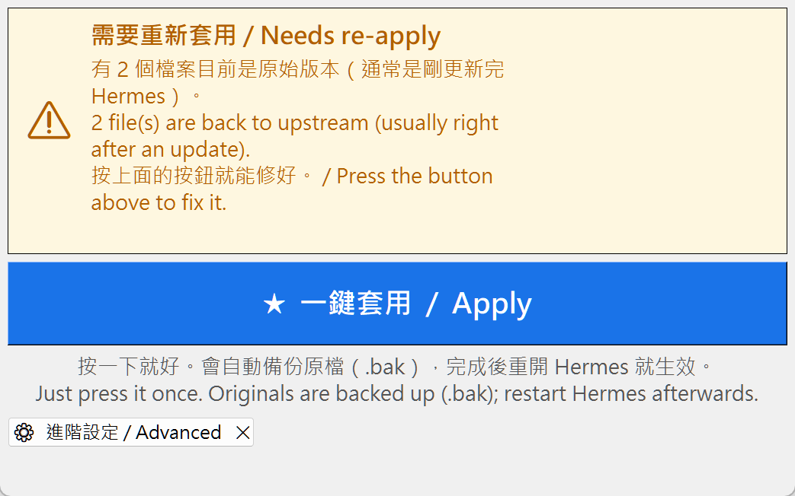
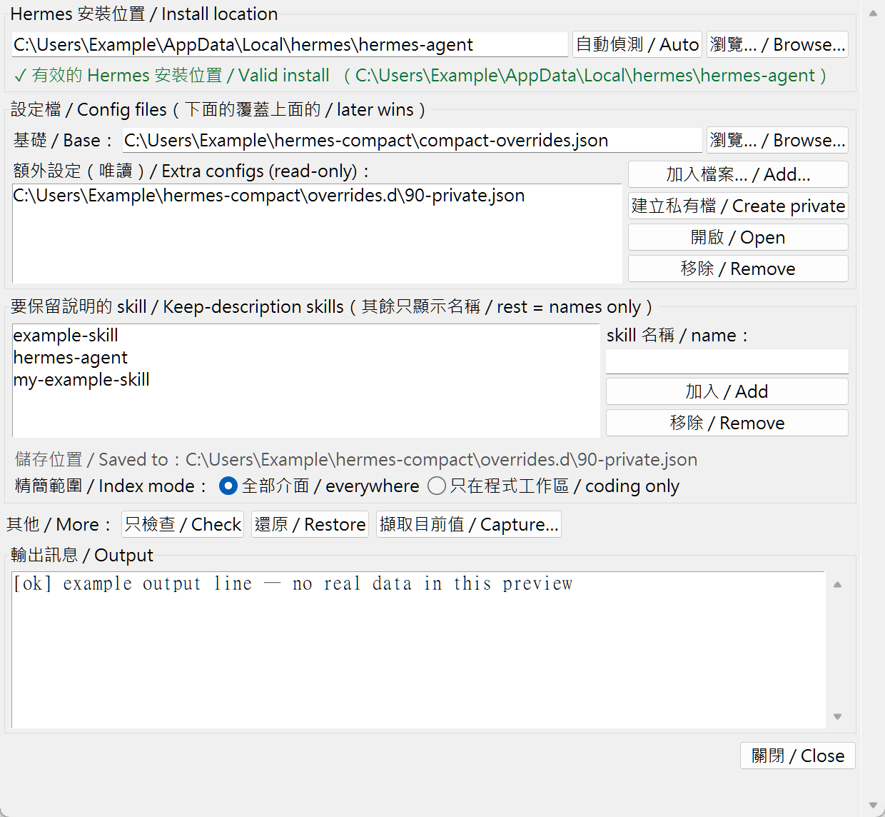

# hermes-lean

**一鍵把精簡後的工具描述與系統提示詞，在每次 `hermes update` 之後重新套用回 Hermes。**

**Re-apply your compact tool & system-prompt descriptions to Hermes with one click (or one command) after every `hermes update`.**

---

## 為什麼需要這個 / Why this exists

Hermes 送給模型的可讀文字很長：每個工具的 schema、好幾段系統提示詞區塊，都寫得鉅細靡遺。這些文字**每一次請求**都會重送，是長期且固定的 token 成本。精簡可降低成本，但必須保留語意並在每次更新後重新驗證；Hermes 的更新器也可能覆蓋手動修改。

Hermes ships long, verbose model-facing text: every tool schema and several system-prompt blocks are written out in full. That text is re-sent on **every** request, so it is a recurring token cost. Compaction can reduce that cost, but wording must preserve semantics and be re-verified after updates; Hermes updates may also overwrite manual edits.

本工具把你的精簡文字保存在**單一資料檔**，一個步驟重新套用。它**完全不碰**記憶、使用者設定檔或任何機密。

This tool keeps your compact wording in **one data file** and re-applies it in one step. It **never** touches memory, the user profile, or any secret.

---

## 快速開始 / Quick start

### 圖形介面（最簡單，可處理自訂路徑）/ GUI (easiest, handles custom paths)

```
compact_ui.bat        # Windows：雙擊 / double-click
./compact_ui.sh       # macOS / Linux / Git-Bash
bash compact_ui.sh    # 若 .sh 沒有執行權限（例如用網頁上傳或下載 ZIP）就改用這個
```

視窗只有**一顆大按鈕**。打開時它會自動檢查，並用顏色告訴你現在的狀況：

The window has **one big button**. On open it checks automatically and uses colour to tell you the state:



| 狀態 / State | 意思 / Meaning | 你要做什麼 / What you do |
|---|---|---|
| ⚠️ **需要重新套用** | 剛更新完 Hermes，檔案被還原成原始版 | **按一下藍色大按鈕** |
| ⚠️ **Needs re-apply** | Hermes was just updated; files are back to upstream | **Press the big blue button** |
| ✅ **一切正常 / All good** | 精簡描述已經套用好了 | 不用做任何事 / nothing to do |
| ❌ **找不到 Hermes** | 安裝位置不對 | 打開「進階設定」選資料夾 |
| ❌ **Not found** | Wrong install path | Open Advanced and pick the folder |

按鈕下方會說明：**按一下就好，會自動備份 `.bak`，完成後要完整重開 Hermes 才生效。**
其他功能（檢查、還原、擷取、設定檔、skill 白名單、精簡範圍）都收在 **⚙ 進階設定 / Advanced** 裡，平常不用打開。

Below the button it says: **just press it once, originals are backed up as `.bak`; fully quit and relaunch Hermes to take effect.**
Everything else (check, restore, capture, config files, skill allowlist, index mode) lives in a separate **⚙ Advanced** window and normally stays closed.



> 「進階設定」會開在**另一個視窗**（主視窗保持精簡，不會被撐大或蓋住）。
> Advanced opens in its **own window** — the main window stays compact and is never resized or covered.

> 介面為**中英雙語**，並支援高 DPI（200% 縮放不模糊）。
> The UI is **bilingual (Chinese / English)** and is high-DPI aware (crisp at 200% scaling).

### 命令列 / Command line

```
python apply_compact.py --yes        # 套用（每個檔案先備份） / apply (backs up each file first)
python apply_compact.py --check      # 試跑：只報告，不寫入 / dry run: report only, write nothing
python apply_compact.py --restore    # 移除管理區塊 / remove the managed blocks
python apply_compact.py --capture captured.json   # 把目前值存成設定檔 / snapshot live values to a config
```

套用後請**完整關閉並重新開啟 Hermes**，新的程序才會載入新的描述。
（在同一個程序裡開新對話並不會生效——Hermes 的程序在啟動時就把這些檔案載入記憶體了。）

After applying, **fully quit and relaunch Hermes** so the new process loads the new descriptions.
(Starting a new chat inside the same running process is not enough — Hermes loads these files into memory at process start.)

### 測試 / Tests

不需安裝第三方測試套件：

```bash
python -m py_compile apply_compact.py compact_ui.py tests/test_security.py tests/test_ui_security.py
python -m unittest discover -s tests -v
```

No third-party test package is required. GitHub Actions runs this suite on Windows, macOS, and Linux.

---

## 它改了什麼 / What it edits

它在**三個檔案結尾**附加一段清楚標記、**自足**的區塊：

It appends one clearly-marked, **self-contained** block to the END of three files:

| 檔案 / File | 區塊控制的內容 / What the block controls |
|------|-------------------------|
| `<hermes-agent>/model_tools.py` | 送給模型的工具與參數描述 / Tool + parameter descriptions sent to the model |
| `<hermes-agent>/agent/prompt_builder.py` | 系統提示詞文案 + 精簡的 skill 索引 / System-prompt guidance strings + the lean skill index |
| `<hermes-agent>/agent/coding_context.py` | skill 索引的**閘門**（何時把分類降級為只留名稱）/ The skill-index *gate* (when to demote categories to names-only) |

這段區塊是**純附加**（接在既有程式碼之後）且**自足**（自己重新宣告文案與自己的 skill 索引渲染器），所以就算更新把檔案主體還原成上游版本，它仍能獨立運作。上游的 `git pull` 改的是檔案主體、不是我們的尾端區塊，因此幾乎不會衝突。重複執行具**冪等性**：它會就地取代自己的區塊，且每個被改的檔案旁都會留下帶時間戳的 `.bak` 備份。

The block is **pure additive** (appended after the existing code) and **self-contained** (it re-asserts its own wording and its own skill-index renderer), so it keeps working even if an update reverts the file body to upstream. An upstream `git pull` edits the file body, not our tail, so conflicts are rare. Re-running is idempotent: it replaces its own block in place, and a timestamped `.bak` is made next to each edited file.

若找不到目標、產生的 Python 無法編譯，或套用後驗證失敗，工具會**以非零結束並回滾所有目標檔案**。寫入使用同目錄暫存檔與原子取代；備份名稱包含微秒且以排他模式建立。

驗證會檢查設定的每個工具／參數名稱在目前 Hermes 中確實存在。若某個名稱已上游改名或移除，該筆覆寫是無效的，工具會**失敗並回滾**，而不是靜默跳過——這也是偵測上游改名的機制。

If a target is missing, generated Python fails compilation, or post-apply verification fails, the tool **exits non-zero and rolls back every target file**. Writes use same-directory temporary files plus atomic replacement; backup names include microseconds and are created exclusively.

Verification also checks that every configured tool/parameter name still exists in Hermes. A renamed or removed name is a silent no-op, so the tool **fails and rolls back** instead of skipping it quietly — this is how upstream renames surface.

---

## 設定檔（共用基礎 + 私有額外）/ Config files (shared base + private extras)

設定檔**依此順序合併**（後者覆蓋前者；字典合併、清單取聯集、以 `_` 開頭的鍵視為註解）：

Configs are **merged in this order** (later wins; dicts merge, lists union, keys starting with `_` are comments):

1. `--config PATH` — 基礎檔（預設 `overrides/compact-overrides.json`）/ the base file
2. `overrides.d/*.json` — 依檔名排序的插入檔 / drop-in additions, sorted by name
3. `--add-config PATH` — 額外檔案，依給定順序 / extra files, in the order given

把**可公開**的文案放在基礎檔，把**私有**內容（你的 skill 白名單、個人化文案）放在 `overrides.d/` 底下。這樣基礎檔可以安全分享，私有部分則被 `.gitignore` 排除。

Put **publishable** wording in the base file and **private** additions (your skill allowlist, personal wording) in a file under `overrides.d/`. That way the base stays safe to share and the private bits are ignored by `.gitignore`.

設定檔格式 / A config is a JSON object:

```jsonc
{
  "tool_descriptions":                  { "clarify": "Ask for decisions or clarification; batch independent questions." },
  "parameter_descriptions":             { "terminal": { "command": "Shell command." } },
  "prompt_strings":                     { "TASK_COMPLETION_GUIDANCE": "…",
                                          "PLATFORM_HINTS__desktop": "…" },
  "skill_description_exception_skills": ["hermes-agent", "systematic-debugging"],
  "skill_index_gate": "focus"           // 或 / or "focus_and_coding"
}
```

從 `compact-overrides.example.json`（基礎）與 `overrides.d/90-private.example.json`（私有插入）開始。

Start from `compact-overrides.example.json` (base) and `overrides.d/90-private.example.json` (private drop-in).

### skill 索引 / The skill index

`skill_index_gate` 控制索引**何時**把分類降級為只留名稱：

`skill_index_gate` controls *when* the index demotes categories to names-only:

- `"focus"` — 只要 `agent.coding_context: focus`（所有介面）/ whenever focus is on (all surfaces).
- `"focus_and_coding"` — 只在程式工作區且為 focus（Hermes 預設）/ only inside a code workspace AND focus (Hermes' default).

`skill_index_categories`（選用）可覆寫被降級的分類清單；`null` 保留模組預設。圖形介面把它做成兩個單選鈕。

`skill_index_categories` (optional) overrides the demoted category list; `null` keeps the module default. The GUI exposes the gate as two radio buttons.

skill 索引依分類列出技能。預設**只顯示名稱**；只有列在 `skill_description_exception_skills` 的技能會保留說明。只留名稱的項目仍可運作，用 `skill_view(name)` 載入即可。

The skill index lists skills by category. By default it shows **names only**; only the skills named in `skill_description_exception_skills` keep their description. Names-only entries still work and load with `skill_view(name)`.

---

## 找不到你的 checkout？/ Finding your checkout

圖形介面會自動偵測 `$HERMES_HOME/hermes-agent`（或平台預設：Windows 為 `%LOCALAPPDATA%\hermes\hermes-agent`，其他平台為 `~/.hermes/hermes-agent`）。如果你的位置不同，用「瀏覽」選到含 `model_tools.py` 的資料夾，或在命令列加 `--hermes-root <path>`。

The GUI auto-detects `$HERMES_HOME/hermes-agent` (or the platform default: `%LOCALAPPDATA%\hermes\hermes-agent` on Windows, `~/.hermes/hermes-agent` elsewhere). If yours lives elsewhere, Browse to the folder that contains `model_tools.py`, or pass `--hermes-root <path>` on the command line.

---

## 安全邊界 / Security boundary

- 只對**你信任的 Hermes checkout** 執行套用或擷取。套用後驗證與擷取會載入該 checkout 的 Python 模組；這和執行 checkout 本身具有相同的信任需求。
- GUI 的自動檢查使用啟動 GUI 的目前 Python，不會因你選了某個資料夾就執行該資料夾內的 `venv`。
- 工具拒絕目標檔案或路徑元件中的 symlink／Windows reparse point，設定檔也會經過嚴格 schema 驗證。
- GUI 匯入的額外 JSON 是唯讀輸入；白名單與模式只寫入被 Git 忽略的 `overrides.d/90-private.json`。

- Apply or capture only against a **Hermes checkout you trust**. Post-apply verification and capture import Python modules from that checkout, which has the same trust requirement as running the checkout itself.
- GUI auto-check uses the interpreter that launched the GUI; selecting a directory never makes auto-check execute that directory's `venv`.
- Target symlinks/Windows reparse points are rejected, and configs receive strict schema validation.
- Extra JSON files imported in the GUI are read-only inputs; allowlist and mode edits only write the Git-ignored `overrides.d/90-private.json`.

---

## 隱私 / Privacy

共用腳本與 `*.example.json` 不含機密、真實本機路徑或個人專用 skill 名稱；範例可能列出公開通用 skill 名稱。你真正的 `overrides/`、`overrides.d/*.json`、UI 狀態、擷取輸出與 `.bak` 已被 Git 忽略。本工具不讀寫 Hermes 的記憶或使用者設定檔。

The shared scripts and `*.example.json` contain no secrets, real local paths, or personal/private skill names; examples may name public generic skills. Real `overrides/`, `overrides.d/*.json`, UI state, captures, and `.bak` files are Git-ignored. The tool does not read or write Hermes memory or the user profile.

---

## 檔案 / Files

```
apply_compact.py                 core tool (apply / check / restore / capture)
compact_ui.py                    GUI front-end (no third-party deps)
compact_ui.bat / .sh             GUI launchers
apply_compact.bat / .sh          CLI launchers
compact-overrides.example.json   publishable base example
overrides.d/90-private.example.json   publishable private-drop-in example
overrides/compact-overrides.json      YOUR base config        (git-ignored)
overrides.d/*.json                    YOUR private configs    (git-ignored)
tests/                                security regression tests
SECURITY.md                           trust boundary + reporting policy
LICENSE                               MIT license
NOTICE                                third-party attribution (Hermes Agent)
```
